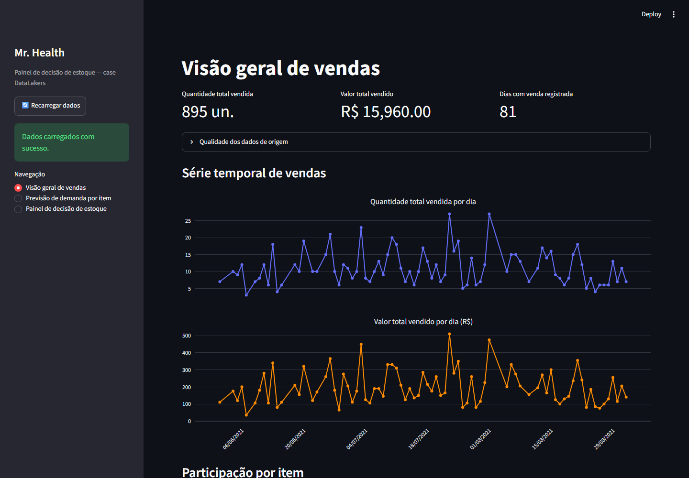
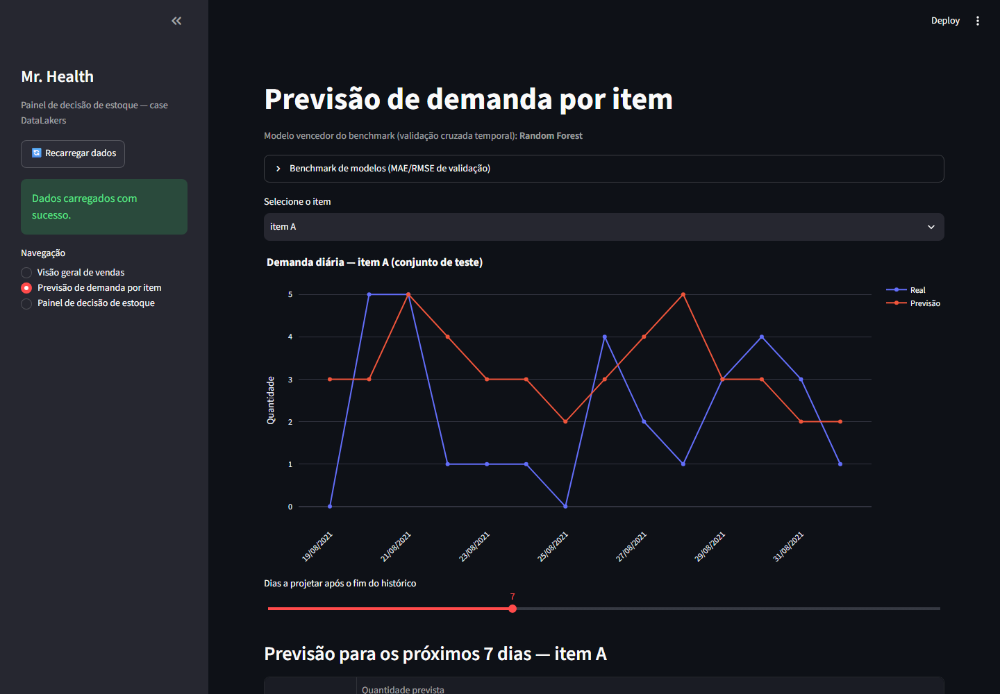
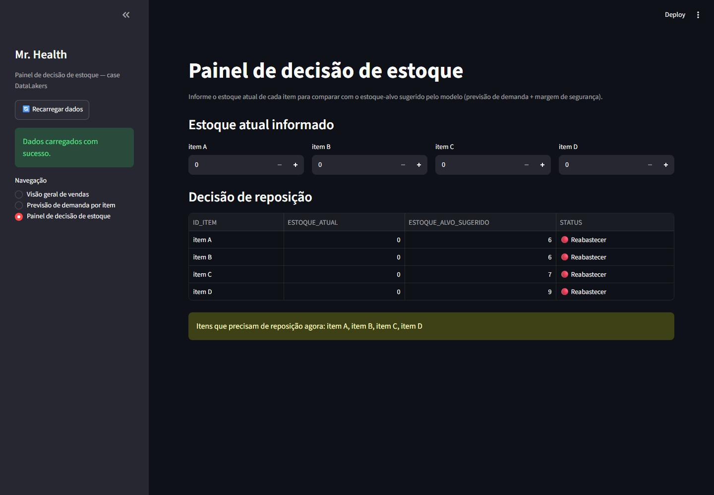

# Case Mr. Health — Previsão de Demanda e Painel de Estoque

Solução para o case técnico da **Mr. Health** (processo seletivo DataLakers):
análise exploratória dos dados históricos de vendas, um modelo preditivo de
demanda por item e um painel interativo de apoio à decisão de reposição de
estoque.

## Sumário

- [Estrutura do projeto](#estrutura-do-projeto)
- [O que este projeto entrega](#o-que-este-projeto-entrega)
- [1. Como abrir e rodar o notebook](#1-como-abrir-e-rodar-o-notebook)
  - [1.1. Localmente (Jupyter / VS Code)](#11-localmente-jupyter--vs-code)
  - [1.2. No Google Colab](#12-no-google-colab)
- [2. Como instalar e rodar o app Streamlit](#2-como-instalar-e-rodar-o-app-streamlit)
- [Dados de origem](#dados-de-origem)
- [Principais achados](#principais-achados)

## Estrutura do projeto

```
.
├── PEDIDO-_1_.xlsx                 # dados de origem: 1 pedido por linha
├── ITEM_PEDIDO-_2_.xlsx            # dados de origem: itens vendidos por pedido
├── ITENS-_3_.xlsx                  # dados de origem: catálogo de produtos e preços
├── requirements.txt                # dependências Python do projeto
├── notebooks/
│   └── mr_health_demand_forecast.ipynb   # notebook principal (EDA + modelo)
├── src/mrhealth/
│   └── pipeline.py                 # lógica de dados/modelo, reaproveitada pelo notebook e pelo app
├── app/
│   └── streamlit_app.py            # painel interativo de decisão de estoque
└── docs/img/                       # capturas de tela deste README
```

## O que este projeto entrega

1. **Notebook** (`notebooks/mr_health_demand_forecast.ipynb`) com:
   - Ingestão e tratamento de qualidade dos três arquivos de origem;
   - Reconstrução do valor total por pedido (o campo original chega vazio);
   - Análise exploratória de vendas (série temporal, sazonalidade semanal, mix de produtos);
   - Benchmark de 4 modelos de regressão (Linear, Random Forest, XGBoost, LightGBM) com validação cruzada temporal;
   - Previsão de demanda por item e recomendação quantitativa de estoque de segurança;
   - Conclusões e recomendações de negócio.
2. **App Streamlit** (`app/streamlit_app.py`) com um painel interativo de decisão de estoque, reaproveitando o mesmo modelo do notebook.

## 1. Como abrir e rodar o notebook

### 1.1. Localmente (Jupyter / VS Code)

Pré-requisitos: Python 3.11+ instalado.

```bash
# a partir da raiz do projeto
python -m venv .venv

# Windows
.venv\Scripts\pip install -r requirements.txt

# macOS/Linux
.venv/bin/pip install -r requirements.txt
```

Depois, abra `notebooks/mr_health_demand_forecast.ipynb`:

- **No VS Code**: instale a extensão "Jupyter", abra o arquivo `.ipynb` e selecione o interpretador/kernel do `.venv` criado acima (canto superior direito do notebook).
- **No Jupyter clássico/Lab**:
  ```bash
  .venv\Scripts\jupyter lab   # Windows
  .venv/bin/jupyter lab       # macOS/Linux
  ```
  e abra o arquivo pela interface do Jupyter.

Depois disso, execute as células em ordem (▶ célula a célula, ou "Run All"). O notebook já localiza os arquivos `.xlsx` automaticamente na raiz do projeto — nenhum caminho precisa ser ajustado.

### 1.2. No Google Colab

O notebook detecta automaticamente quando está rodando no Colab e já vem configurado com a URL deste repositório (variável `GITHUB_REPO_URL`, na célula de setup) — ao rodar essa célula, ele clona o repositório sozinho e localiza os dados e o código compartilhado (`pipeline.py`) automaticamente.

**Opção A — abrir direto do GitHub (mais simples):**

1. Acesse [colab.research.google.com](https://colab.research.google.com).
2. **Arquivo → Abrir notebook → aba GitHub**, informe `daniballester-ai/mr_health_demand_forecast` e selecione `notebooks/mr_health_demand_forecast.ipynb`.
3. Execute as células em ordem (▶ célula a célula, ou **Ambiente de execução → Executar tudo**).

**Opção B — upload manual do arquivo local:**

1. Acesse [colab.research.google.com](https://colab.research.google.com).
2. **Arquivo → Fazer upload de notebook** e selecione o arquivo local `notebooks/mr_health_demand_forecast.ipynb`.
3. Execute as células em ordem — como o notebook já tem `GITHUB_REPO_URL` preenchida, o clone acontece automaticamente na primeira célula.

> Caso use uma cópia própria do notebook (fork ou outro repositório), basta editar `GITHUB_REPO_URL` no topo da célula de setup com a URL do seu repositório. Se deixar essa variável em branco, o Colab pede para enviar manualmente os 3 arquivos `.xlsx` e o `pipeline.py`.

O Colab já vem com a maior parte das bibliotecas necessárias pré-instaladas; a própria célula de setup instala as que faltam (`lightgbm`, `openpyxl`).

## 2. Como instalar e rodar o app Streamlit

O app é um painel interativo que reaproveita o mesmo modelo do notebook, pensado para uso pela equipe de operações (sem precisar rodar código).

**Instalação** (mesmo ambiente virtual usado para o notebook):

```bash
python -m venv .venv                            # se ainda não existir

# Windows
.venv\Scripts\pip install -r requirements.txt

# macOS/Linux
.venv/bin/pip install -r requirements.txt
```

**Execução:**

```bash
# Windows
.venv\Scripts\streamlit run app\streamlit_app.py

# macOS/Linux
.venv/bin/streamlit run app/streamlit_app.py
```

O comando abre automaticamente o navegador padrão em `http://localhost:8501`. O app tem 3 telas, acessíveis pelo menu "Navegação" na barra lateral:

### Visão geral de vendas

KPIs (quantidade e valor total vendido), qualidade dos dados de origem, série temporal e participação por item. Todos os gráficos são interativos (passe o mouse para ver valores exatos, arraste para dar zoom, use a barra de ferramentas do gráfico para resetar o zoom ou baixar como imagem).



### Previsão de demanda por item

Mostra o modelo vencedor do benchmark, permite selecionar um item (A a D) para ver a previsão no histórico recente e projetar a demanda para os próximos dias.



### Painel de decisão de estoque

Você informa o estoque atual de cada item e o app compara com o estoque-alvo sugerido pelo modelo, sinalizando quais itens precisam de reposição.



> Use o botão **"Recarregar dados"**, na barra lateral, sempre que os arquivos `.xlsx` de origem forem atualizados — ele força o app a reler os dados e retreinar o modelo do zero.

## Dados de origem

| Arquivo | Conteúdo |
|---|---|
| `PEDIDO-_1_.xlsx` | Um pedido por linha (`ID_PEDIDO`, `DATA`, `VALOR_TOTAL`) |
| `ITEM_PEDIDO-_2_.xlsx` | Itens vendidos em cada pedido (`ID_PEDIDO`, `ID_ITEM`, `QUANTIDADE`) |
| `ITENS-_3_.xlsx` | Catálogo de produtos e preço unitário (itens A a D) |

O campo `VALOR_TOTAL` chega **100% vazio** da origem e é reconstruído no notebook a partir do cruzamento entre `ITEM_PEDIDO` e `ITENS` — esse e outros achados de qualidade de dados estão documentados na seção 2 do notebook.

## Principais achados

- O modelo vencedor do benchmark (validação cruzada temporal entre Regressão Linear, Random Forest, XGBoost e LightGBM) supera um baseline ingênuo (previsão = valor do dia anterior) em erro médio (MAE).
- A previsão é feita tanto agregada (rede completa) quanto por item, permitindo uma recomendação de estoque de segurança e estoque-alvo específica por produto.
- Limitações conhecidas (curto histórico disponível, ausência de dado por unidade/filial) estão documentadas na conclusão do notebook, junto com recomendações de melhoria para quando mais dados históricos estiverem disponíveis.
